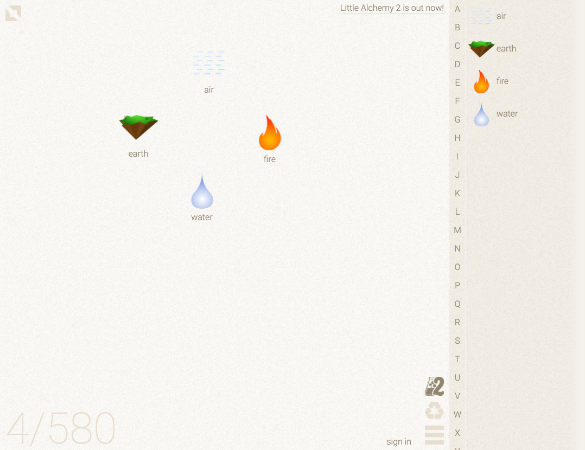
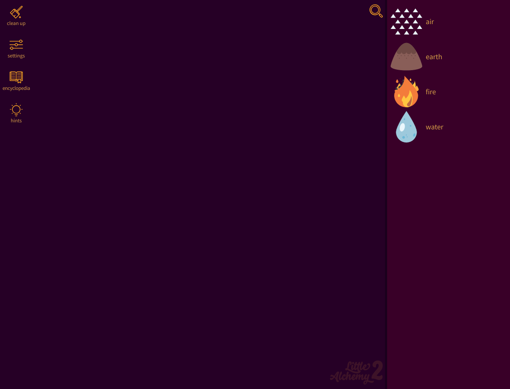

# Little Alchemy Game

Мы предлагаем вам сделать простую игру-головоломку по типу  Little Alchemy.  

## Концепция

Little Alchemy - это простая, но в то же время креативная игра, один из множества клонов игр про объединение и комбинирование элементов, появившихся после взрывной популярности Doogle God и подобных игр той же серии. Можно играть в браузере на любом современном устройстве – компьютере, планшете или телефоне. Даже под Linux и MacOS, не говоря уже об Android.

## Малая Алхимия состоит из таких элементов:

- в правой части  экрана - панель инструментов;
- в начале игры на этой панели инструментов расположены четыре элемента: вода, огонь, земля, воздух;
- справа будут размещены те элементы, которые уже получилось создать;
- слева – рабочий стол, где можно смешивать и получать новые комбинации в этой игре;
- корзина.

Не ограничивайте вашу фантазию этим списком и добавляйте новые элементы.

## Цель игры

Целью игры Little Alchemy является смешивание элементов для поиска новых элементов. Комбинируйте между собой элементы и открывайте новыe. Чтобы комбинировать элементы между собой, необходимо перетаскивать их, накладывая друг на друга. Создав несколько базовых элементов, можно начинать придумывать реакции. Например:
попробуйте смешать два воздуха вместе, они предоставят Вам новый элемент - "PSI" или давление.

## Как это работает:

- перетащите один элемент на другой или выделите мышью несколько элементов, чтобы запустить реакцию;
- дважды кликните по полю, чтобы добавить новую порцию базовых элементов;
- дважды кликните по элементу, чтобы его стало два;
- перетащите элемент в корзину, чтобы убрать его с поля;
- можно перетаскивать элементы на поле из списка.

## [Рецепты](receipts.txt)

## Примеры дизайна

 
 
 

 
 
 
 
 
 

## Полезные ссылки

- [18 игр, как Alchemy](https://ru.trend-top.com/18-games-like-alxemy)
- [Игра Little Alchemy](https://littlealchemy.com/)
- [How to make Darth Vader in Little Alchemy](https://www.youtube.com/watch?v=wxy3AmbcoRA&ab_channel=GambleDude)
