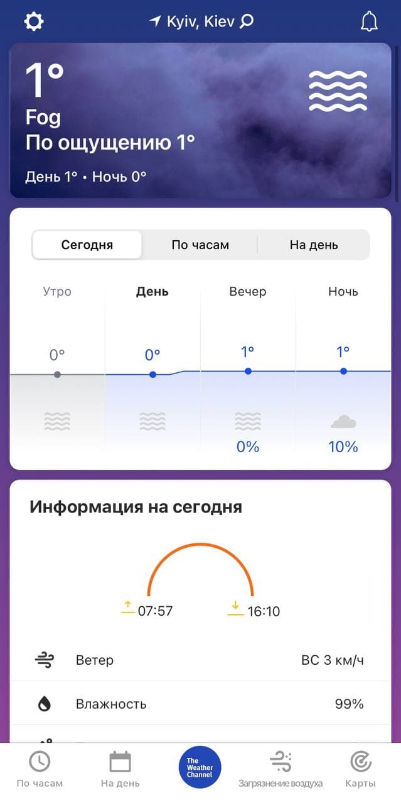

# Weather Application


# Как создать приложение о погоде

Будем справедливы: погода имеет особое значение в жизни всего человечества. Каждый день люди из разных уголков нашей планеты интересуются прогнозом погоды, чтобы строить планы на завтрашний день. Все мы хотим знать, чего ожидать: дождя или снега, жары или тумана. А поскольку у нас нет дара пророчества, мы прибегаем к помощи соответствующих служб для получения актуальных погодных данных, чем и объясняется постоянный спрос на подобные программы.

Итак, что это такое - метеорологическое приложение? 
Ответ прост: это сервис, который сообщает своим пользователям, какую погоду они должны ожидать в ближайшие несколько часов, дней, недель.

## Оптимальная функциональность мобильного приложения погоды

Особенности погодного приложения: точные подробные прогнозы, которые в идеале должны содержать не только данные о температуре воздуха, но и отчеты о различных метеорологических условиях (не забывайте об осадках, скорости ветра, интенсивности ультрафиолетового излучения). 

Отличным выбором будут следующие форматы: 
 - почасовой прогноз;
 - двухнедельные прогнозы;
 - прогнозы на выходные дни (чтобы пользователи могли думать о выходных с учетом погодных условий).
 - интерактивные карты;
 - отчет в режиме реального времени о погодных условиях;
 - анимация восходов, закатов и фаз Луны, например (анимированное погодное приложение воспринимается аудиторией гораздо лучше);
 - возможность выбора городов для мониторинга температуры воздуха, скорости и направления ветра, влажности и осадков (путешественники ценят это) и т.п.;
 - умные уведомления: быстрые оповещения об изменениях метеорологической погоды, ураганах, ураганах, землетрясениях и т.д.;

## Лучшие инструменты для правильного прогнозирования погоды

Очевидно, что вам нужно получить данные прогноза погоды для вашего приложения! Мы советуем вам воспользоваться профессиональными источниками, которые позволяют разработчикам получать информацию о метеорологических условиях, которые они собрали.

Таких источников очень много, но мы напишем про лучших:

### Weather Underground API
https://www.wunderground.com/

Погодная компания имеет свой собственный мобильный сервис, ориентированный на пользователей, которые заинтересованы в знании метеорологических условий. Но компания не оставляет без внимания сторонних разработчиков, желающих создавать погодные приложения, и предлагает им несколько пакетов API. Что выбрать, зависит от конкретной ситуации и задачи.Погодная компания имеет огромное количество собственных метеостанций, поэтому задача получения необходимых данных упрощается.

### API Openweathermap
https://openweathermap.org/api
Openweathermap API является еще одним хорошим вариантом, если вы хотите знать, как сделать приложение погоды простым способом.Модуль был создан энтузиастами, которые считают, что метеорологическая информация должна быть бесплатной и доступной. Поэтому они предоставляют нам API с открытым исходным кодом для получения текущих погодных данных.Кстати, в последнее время модуль активно поддерживает экспорт метеорологических данных со своих метеостанций.

### AccuWeather
https://www.accuweather.com/

Преимущества:самая полная база прогнозных моделей со всего мира; опыт в области цифровой обработки данных о погоде на протяжении 30 с лишним лет; самый большой и лучший набор данных в режиме реального времени.

### Foreca API 
https://corporate.foreca.com/en/

Доступная информация: нынешние условия, а именно - новейшие измерения, проводимые официальными метеорологическими станциями во всех частях мира; искусственные прогнозы; технология Foreca Nowcasting решает проблему нехватки станций (это иногда случается, увы); ее суть в умении искусственно предсказывать (используя имеющиеся данные) возможность дождя, жары, снегопада и прочего подобного рода; прогнозирование на различные промежутки времени, начиная от 15 минут и заканчивая более длительными периодами.

## Для вдохновения: интересные и красивые приложения о прогнозе погоды 

### The Weather Channel
Одно из самых точных погодных приложений. Предоставляет прогнозы погоды на каждый час, на 15 дней и на выходные. Из сводок можно узнать о реальной и ощущаемой температуре, скорости ветра, осадках и интенсивности ультрафиолетового излучения.

<p align="center">
  
</p>

### Weather Underground
Приложение может всё то же самое, что и прочие погодные приложения в списке, но обладает ещё и собственными фишками: инфо о качестве воздуха и уровне ультрафиолетового излучения в вашем городе, о вспышках гриппа или угрозах аллергии. С помощью веб-камер приложение позволяет посмотреть, что именно происходит в том или ином городе.


### Yahoo Погода
Это, безусловно, одно из красивейших приложений списка. «Yahoo Погода» постоянно загружает великолепные фотографии с Flickr и автоматически выбирает фоны, соответствующие вашему местоположению, времени суток и метеоусловиям. Выглядит это очень эффектно. Приложение может показывать погоду одновременно в 20 городах. Дополняют привычную информацию интерактивная погодная карта, предупреждения о плохой погоде, красивые анимации восхода и захода.

### YoWindow
Красивое погодное приложение с интересной особенностью. Цифры и значки расположены в верхней части экрана, а всё остальное пространство занимает пейзаж, зависящий от происходящего за окном. Дождь и солнце, восходы и закаты, времена года сменяют друг друга, как в реальности. Кстати, пейзаж можно выбрать и установить в качестве обоев.

### CARROT Weather
CARROT Weather выделяется обилием чёрного юмора. Что бы ни творилось за окном, у приложения найдётся ехидный комментарий. Циничные замечания и шутки отпускаются и в адрес пользователя. К сожалению, только по-английски. Вдобавок в CARROT Weather полно сюрпризов. Например, функция Time Travel позволяет узнать, какая погода была в прошлом.

### Weather Radar Forecast
Приятное приложение с интересной фишкой: оно умеет подстраивать фон вашего экрана блокировки к происходящему за окном. Кроме того, тут есть разнообразные виджеты со сведениями о погоде в реальном времени, изображениями вашего города, часами и календарем. Ещё приложение умеет присылать оповещения о внезапных ураганах, бурях и лавинах.

### RANE°
В этом приложении нет ничего лишнего. Только прогноз на ближайшие пять дней с температурой, давлением и данными об осадках. Дизайн RANE° очень прост и элегантен. Анимации плавные, управление удобное. RANE° — хороший вариант для тех, кто устал от перегруженных интерфейсов.

[feature](weather.feature)

```gherkin
Feature: weather in location
  As a User I want to see information about weather in chosen location

  Scenario: Choose location
    Given open weather application
    When enter name of location
    Then show information about weather in the location
     And show weather forecast for one week

  Scenario: choose F and C
    Given open weather application
    When switch between F and C
    Then information about temperature in current location in chosen format
```
